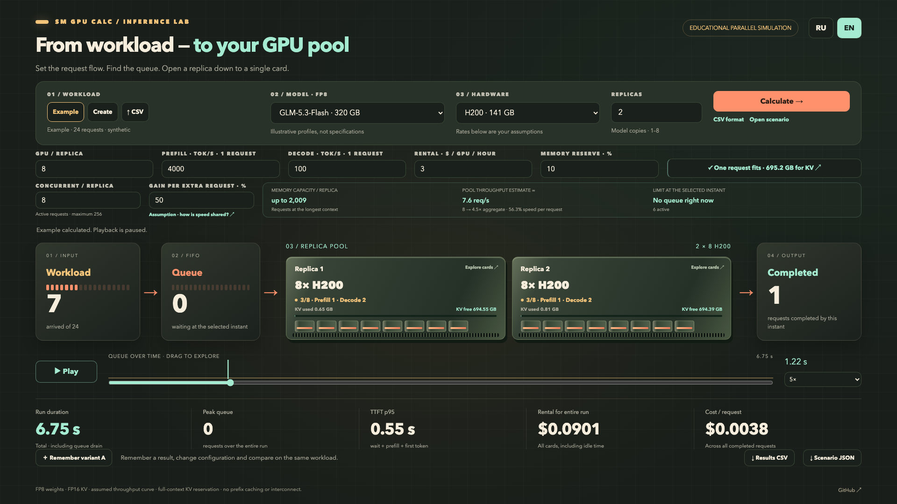
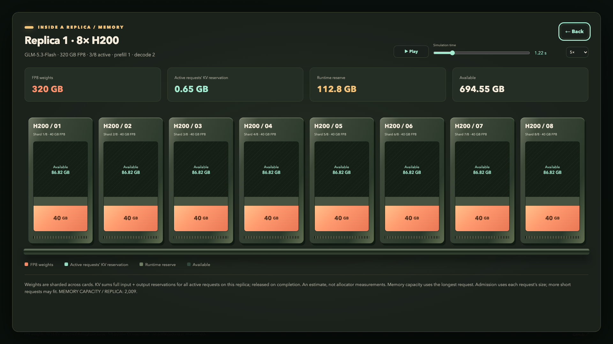

# SM GPU Calc

**LLM workload → queue → GPU replicas → memory, latency and cost.**

[Open the calculator](https://mikhaylov.com/gpu-calc/?lang=en) · **English** · [Русский](README.ru.md)

`MIT` · `HTML / CSS / JavaScript` · `Static hosting` · `RU / EN`

An interactive, educational GPU inference simulator. Explore how request arrivals,
parallel processing and KV memory affect queues and latency. All calculations run
in your browser; model profiles and throughput curves are assumptions, not benchmarks.

### Workload and live GPU pool

Play the timeline or move the slider to inspect active requests, the queue and free
KV memory on each replica.



### Inside a replica

Open a replica to see model shards, KV reservations, runtime reserve and free memory
on each GPU. Playback controls also work here.



### What you can explore

- **Workload:** start with the demo, create a uniform request stream, or import CSV.
- **Hardware:** choose a model profile, H200/B200, 1–16 GPUs per replica and 1–8 replicas.
- **Parallelism:** allow 1–256 active requests per replica and set an explicit throughput-gain assumption.
- **Memory:** each active request reserves KV; requests wait if slots or memory are unavailable. Memory is released on completion.
- **Playback:** follow prefill/decode phases, queue length, completed requests and free KV memory. Drill into a replica without stopping playback.
- **Results:** compare run duration, peak queue, p95 time to first token, total rental and cost per request.
- **Scenarios:** save variant A for comparison, export results as CSV, and save/reopen JSON scenarios.

A **replica** is one copy of the model spread across its GPUs. Eight GPUs in a
replica jointly serve its requests; they are not eight independent model copies.

### Run locally

Download or clone the repository, then run from its root:

```sh
python3 -m http.server 8000 --directory distr
```

Open [localhost:8000](http://localhost:8000/). You can also open `distr/index.html`
directly; keep `sim-core.js` and `scenario-core.js` beside it. No npm installation,
backend or GPU is required. The unified page has no external runtime resources.

### Create a workload

**Example** loads 24 synthetic requests arriving every 200 ms. **Create** opens a
form for total requests, RPS, input tokens and output tokens per request.
**RPS** means incoming requests per second, not completed responses per second.
The simulator uses token counts; it does not send prompts to an actual model.

CSV requires these four columns:

```csv
request_id,arrival_ms,input_tokens,output_tokens
r1,0,10000,1000
r2,200,10000,1000
r3,400,5000,500
```

`arrival_ms` is time from the scenario start. IDs must be unique; token counts and
arrival times must be integers, input ≥ 0 and output ≥ 1. Limit: 10,000 requests,
2 MiB per CSV. The simple parser does not support quoted or multiline fields.
Additional metadata is preserved; dependencies do not affect execution.
Files are processed locally in your browser.

### Interpret the results

Solo prefill/decode rates are for one request on the **whole replica**, not each
GPU. With `n` active requests and gain `g`, assumed aggregate throughput scales as
`G(n) = 1 + (n − 1) × g`; each request receives `G(n) / n` of its solo rate.
The UI expresses `g` as a percentage: 0% shares fixed throughput, 100% assumes ideal
linear scaling. The default 50% is illustrative and should be replaced with measurements.

KV reserves the full input + output context at admission. It changes when requests
start or finish; gradual token-by-token growth and prefix-cache reuse are not modeled.
The memory-capacity estimate uses the longest request. Free memory alone does not
guarantee fast responses or a particular number of users.

The displayed queue restriction describes this scheduler's slot/memory limits,
not the physical GPU bottleneck. Profiles are not calibrated; there is no chunked
prefill, interconnect model, preemption or DAG execution. Rental includes all GPUs
from the scenario start to the last completion, including idle time.

See the [calculation contract, formats and limitations](docs/UNIFIED-SCENARIO.md).

### Share settings

URLs can initialize `lang`, `model`, `gpu`, `replicas`, `cards`, `prefill`, `decode`,
`price`, `reserve`, `concurrency` and `batchGain`. Model keys are `glm53`, `flash`
and `qwenflash`. `progress=0..1` selects a point in the run; `drill=1` opens a replica.

```text
index.html?lang=en&model=glm53&gpu=B200&replicas=2&cards=8&concurrency=8&batchGain=50
index.html?lang=ru&progress=0.5&drill=1
```

URLs contain settings, not imported workload data. Use a saved JSON scenario to
reproduce a custom workload. Older `/1` scenarios reopen with one active request
per replica; new saves use `/2`.

### Publish to static hosting

```sh
bash scripts/release.sh
```

The script synchronizes `distr/`, runs core tests and browser render checks, versions
JavaScript URLs with content hashes, and creates a ZIP under `releases/`.
It requires Node.js, Python 3 and Chrome (`CHROME_BIN` can specify its path).
There is no automatic upload.

Deploy the **entire generated ZIP** together. It contains only the allowed HTML,
JavaScript and version files. Content hashes prevent a new page from using an old
cached engine. Rebuild after editing JavaScript; copying only `index.html` is not
sufficient. Use UTF-8 and serve `index.html` as the directory index.

## Repository

| Path | Purpose |
| --- | --- |
| `simulation.html` | Unified interface |
| `sim-core.js` | FIFO scheduling, sharing and KV admission |
| `scenario-core.js` | Profiles, memory, CSV and JSON |
| `distr/` | Static distribution; `index.html` and `simulation.html` are identical |
| `tests/sim-core.test.js` | Core and scenario tests |
| `scripts/release.sh` | Checks, asset versions, distribution and ZIP |
| `scripts/render-check.sh` | Chrome screenshots and runtime checks |
| `docs/UNIFIED-SCENARIO.md` | Calculation contract (Russian) |
| `docs/PLAN.md` | Roadmap (Russian) |

## Contributing & license

Run core tests with `node --test tests/sim-core.test.js`. For UI changes, also run
the browser render check and inspect screenshots. See [CONTRIBUTING.md](CONTRIBUTING.md).

[MIT License](LICENSE) · Copyright © 2026 Sergei Mikhailov
[Website](https://mikhaylov.com/gpu-calc/) · [GitHub](https://github.com/bzSega/sm-gpu-calc)
